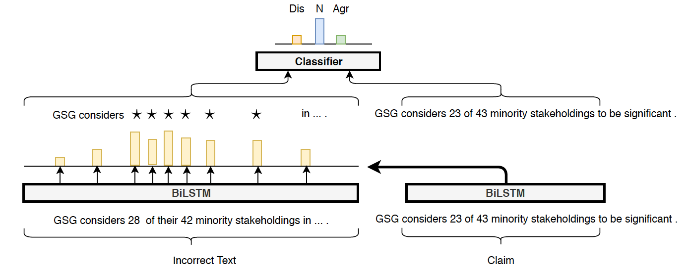

# TokenMasker
This repository contains the code for the masker module from the paper [Automatic Fact-guided Sentence Modification](https://arxiv.org/pdf/1909.13838.pdf) (AAAI 2020)

The multiple-encoder pointer-generator is available [here](https://github.com/darsh10/split_encoder_pointer_summarizer).

## Description
The goal of the masker is to find the minimal group of tokens can be removed from a sentence in order to modify the relation of it with another setentence. For example, given a pair of claim and evidence sentences, it finds the words to delete from the evidence that will make it neutral with respect to the claim. The neutrality is determined by a pretrained classifier.

For example:

* Claim: *Eddie Vedder sings.*
* Evidence: *He is known for his powerful baritone vocals.*
* Model's output: *He is known for $ powerful $ $.* ($ symbols a masked token)





## Setup
You'll need the allennlp repo (version 0.8.3)
```
pip install -r requirements.txt
```

## Training

### Neutrality classifier

Note - To train a masker with our neutrality pretrained classifier, skip to the next step (the config file has the path to our trained model).

```
allennlp train allen_configs/esim_fever_wmask.jsonnnet -s trained_neutrality_classsifier --include-package masker_allen_pkg
```

### Masker

```
allennlp train allen_configs/mask_generator.jsonnet -s trained_mask_generator --include-package masker_allen_pkg
```

## Extracting masks

### Trained model

To get the trained masked model and preprocessed FEVER trainied data:
```
wget https://www.dropbox.com/s/do5jptwmgroencn/model.tar.gz
wget https://www.dropbox.com/s/o53i6urucny7q03/fever.train_no_nei.tokenized.jsonl
```

### Command
To create masks for the data (add -c to use gpu):
```
python model_predictions.py -f model.tar.gz \
-i fever.train_no_nei.tokenized.jsonl \
-out predictions/fever_train_no_nei.jsonl
```

# Citation
If you find this repository helpful, please cite our paper:
```
@inproceedings{shah2020automatic,
  title={Automatic Fact-guided Sentence Modification},
  author={Darsh J Shah and Tal Schuster and Regina Barzilay},
  booktitle={Association for the Advancement of Artificial Intelligence ({AAAI})},
  year={2020},
  url={https://arxiv.org/pdf/1909.13838.pdf}
}
```
